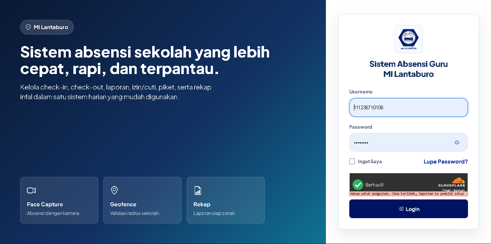
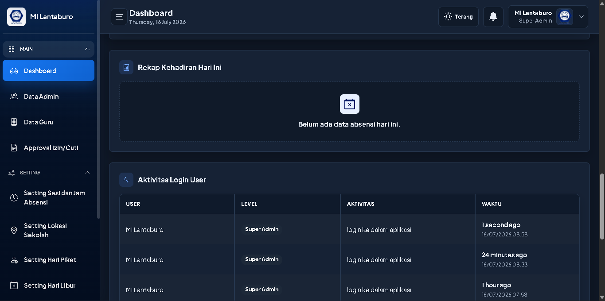
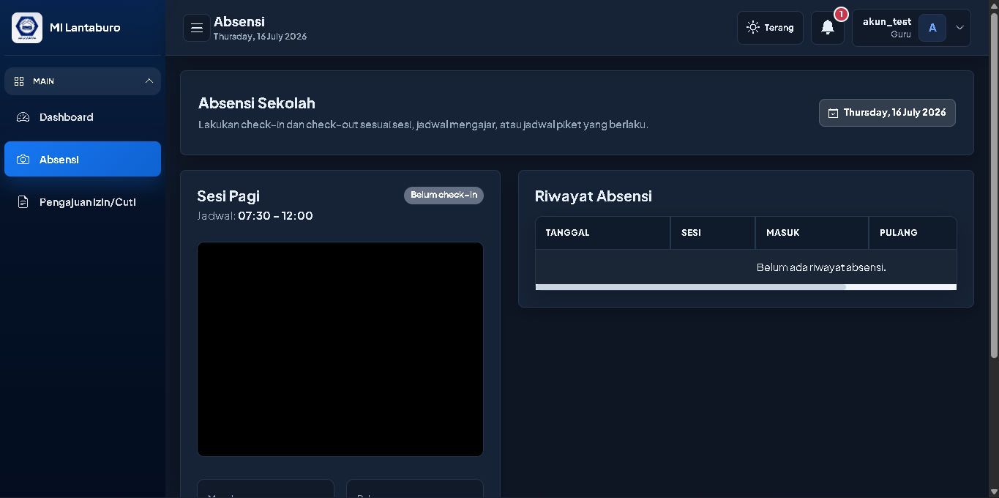
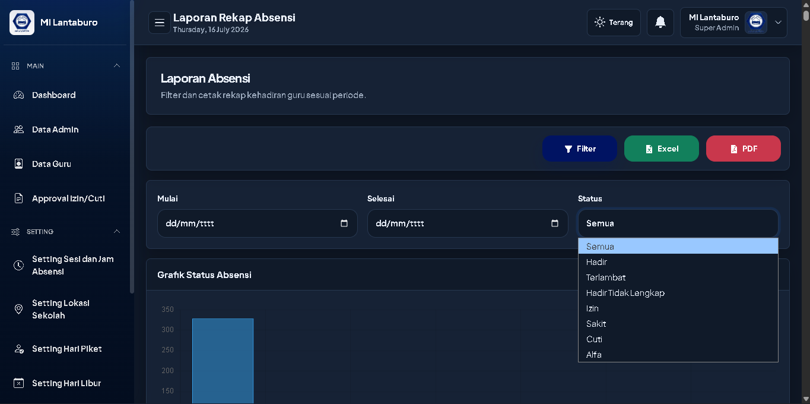
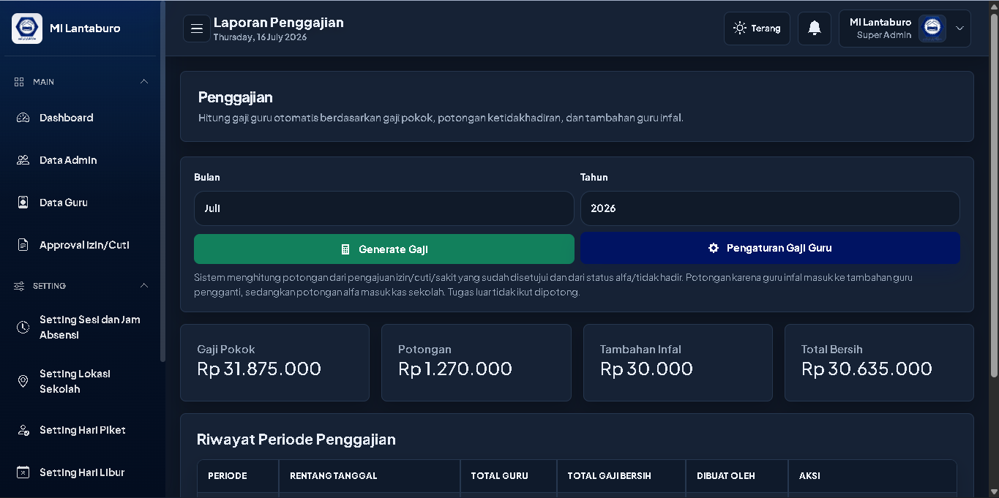

# Sistem Absensi Sekolah

Aplikasi web berbasis Laravel untuk mengelola kehadiran guru/karyawan sekolah dalam satu dashboard operasional: absensi berbasis lokasi dan foto, pengajuan izin/cuti, jadwal piket, hari libur, laporan, hingga penggajian. Dirancang untuk kebutuhan internal sekolah dengan alur kerja harian yang mudah dipantau oleh guru, kepala sekolah, bendahara, dan super admin.

## Fitur Utama

- **Autentikasi & role** — login via NIP/username dengan hak akses guru, bendahara, kepala sekolah, dan super admin.
- **Absensi** — check-in/check-out per sesi dengan validasi radius lokasi (geofence) dan face capture sebagai bukti foto.
- **Izin & cuti** — pengajuan izin, sakit, cuti, tugas luar, dan izin sementara, lengkap dengan alur approval dan penunjukan guru infal.
- **Dashboard** — ringkasan kehadiran harian dan panel guru yang belum absen untuk pemantauan cepat.
- **Laporan** — rekap absensi dan rekap guru infal dengan filter status/periode, plus export Excel/PDF.
- **Penggajian** — perhitungan gaji pokok, potongan ketidakhadiran/alfa, dan tambahan infal.
- **Pengaturan** — data pengguna & guru, lokasi sekolah, sesi absensi, hari libur, dan jadwal piket.
- **Lainnya** — auto-status alfa setelah batas check-in, tema light/dark, dan UI responsif untuk desktop maupun mobile.

## Teknologi

Laravel 12 · PHP 8.2+ · MySQL/MariaDB · Bootstrap 5 · Chart.js · Laravel DomPDF · Laravel Excel

## Instalasi

```bash
composer install
cp .env.example .env
php artisan key:generate
# sesuaikan koneksi database di .env
php artisan migrate --seed
php artisan serve
```

## Tangkapan Layar

<details>
<summary>Klik untuk melihat tangkapan layar</summary>

**Login**



**Dashboard**



**Absensi**



**Laporan Rekap Absensi**



**Penggajian**



</details>

## Catatan Face Recognition

Versi saat ini memakai face capture sederhana sebagai bukti foto absensi. Untuk face recognition berbasis embedding wajah, pendekatan yang disarankan adalah service Python self-hosted yang menerima foto dari Laravel, membuat embedding, lalu mencocokkannya dengan data wajah yang telah didaftarkan.

## Catatan Repository

Repository ini dipublikasikan sebagai referensi, namun tidak sepenuhnya open source. Sebagian berkas rahasia serta konfigurasi dan dokumentasi internal sengaja tidak disertakan, sehingga sebagian penyesuaian untuk lingkungan produksi perlu dieksplorasi dan dikonfigurasi sendiri.

## Lisensi

Dirilis di bawah lisensi [GNU General Public License v3.0](LICENSE). Anda bebas menggunakan, mempelajari, memodifikasi, dan mendistribusikan ulang perangkat lunak ini selama karya turunan tetap dirilis di bawah lisensi yang sama.
